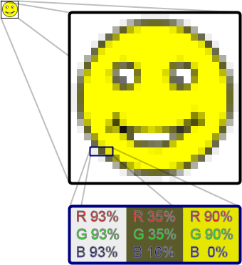

## Working with Rasters

### Let's get set up first

Check if you can see the data - your working directory should be this file's location, and your data should be in Data/
```{r, eval=FALSE}
file.exists("Data/Cairns_Mangroves_30m.tif")
file.exists("Data/SST_feb_2013.img")
file.exists("Data/SST_feb_mean.img")
```

You should also have a folder Output/ for when we export results

Install the packages we're going to need - raster for raster objects, dismo is SDM, rgdal to read and write various spatial data
```{r, eval=FALSE}
install.packages(c('raster', 'dismo','rgdal', 'gstat'))
```

Check that you can load them
```{r, eval=FALSE}
library(raster)
library(dismo)
library(rgdal)
```


### What is a raster?
Now we're ready to go, but firstly, what is a raster? Well, simply, it is a grid of coordinates for which we can define a value at certain coordinate locations, and we display the corresponding grid elements according to those values. The raster data is essentially a matrix, but a raster is special in that we define what shape and how big each grid element is, and usually where the grid should sit in some known space (i.e. a geographic projected coordinate system).



### Understanding Raster Data

Make a raster object, and query it
```{r, eval=FALSE}
x <- raster(ncol = 10, nrow = 10) # let's make a small raster
nrow(x) # number of pixels
ncol(x) # number of pixels
ncell(x) # total number of pixels 
plot(x) # doesn't plot because the raster is empty
hasValues(x) # can check whether your raster has data
values(x) <- 1 # give the raster a pixel value - in this case 1
plot(x) # entire raster has a pixel value of 1 
```

Make a random number raster so we can see what's happening a little easier
```{r, eval=FALSE}
values(x) <- runif(ncell(x)) # each pixel is assigned a random number
plot(x) # raster now has pixels with random numbers
values(x) <- runif(ncell(x))
plot(x)
x[1,1] # we can query rasters (and subset the maaxtrix values) using standard R indexing
x[1,]
x[,1]
```

Use this to interactively query the raster - press esc to exit
```{r, eval=FALSE}
click(x)
```

What's special about a raster object?
```{r, eval=FALSE}
str(x) # note the CRS and extent, plus plenty of other slots
crs(x) # check what coordinate system it is in, the default in the PROJ.4 format
xmax(x) # check extent
xmin(x)
ymax(x)
ymin(x)
extent(x) # easier to use extent
res(x)  # resolution
xres(x) # just pixel width
yres(x) # just pixel height
```

#### Excercises
* make a raster with a smiley face
* extract some vector and matrix data from the raster
* subset the raster into a smaller chunk (tricker - see ```?"raster-package"```)


### Working with real raster data

Import the Cairns mangrove data and have a look at it
```{r, eval=FALSE}
mangrove <- raster("Data/Cairns_Mangroves_30m.tif") 
crs(mangrove) # get projection
plot(mangrove, col = topo.colors("2")) # note two pixel values, 0 (not mangrove) and 1 (mangrove)
NAvalue(mangrove) <- 0 # make a single binary dataset with mangroves having a raster value 1
plot(mangrove, col = "mediumseagreen")
```

The legend is a little odd - we can change to a categorical legend by doign this - but we'll stick to the default continous bar generally so as to reduce clutter in the code
```{r, eval=FALSE}
cols <- c("white","red")
plot(mangrove, col=cols, legend=F)
legend(x='bottomleft', legend=c("no mangrove", "mangrove"), fill=cols)
```

Simple processing
```{r, eval=FALSE}
agg.mangrove <- aggregate(mangrove, fact=10) # aggregate/resample cells (10 times bigger)

par(mfrow=c(2,2))
plot(mangrove, col = "mediumseagreen")
plot(agg.mangrove, col = "firebrick")
plot(agg.mangrove, col = "firebrick")
plot(mangrove, col = "mediumseagreen", add=TRUE) # add information to current plot
```

Create a simple buffer
```{r eval=FALSE}
buf.mangrove <- buffer(agg.mangrove, width=1000) # add a buffer
par(mfrow=c(1,1))
plot(buf.mangrove, col = "peachpuff")
plot(mangrove, col = "mediumseagreen", add = T) # note add= argument
```

Convert raster to point data, and then import point data as raster
```{r, eval=FALSE}
pts.mangrove <- rasterToPoints(mangrove)
str(pts.mangrove)

par(mfrow=c(2,2))
plot(mangrove)
plot(rasterFromXYZ(pts.mangrove)) # huh?

NAvalue(mangrove) <- -999
pts.mangrove <- rasterToPoints(mangrove)
plot(rasterFromXYZ(pts.mangrove))

NAvalue(mangrove) <- 0 # set it back to 0
par(mfrow=c(1,1))
```

Export your data - lets try the aggregated raster
```{r, eval=FALSE}
KML(agg.mangrove, "Output/agg.mangrove.kml", overwrite = TRUE)
writeRaster(agg.mangrove, "Output/agg.mangrove.tif", format = "GTiff")
```

Hang on, what about multiband rasters? The raster package handles them in the same way, just the ```nbands()``` attribute is >1 - think about an array instead of a matrix
```{r, eval=FALSE}
multiband <- raster("Data/multiband.tif")
nbands(multiband)
nrow(multiband) 
ncol(multiband) 
ncell(multiband) 
```

What about making our own multiband raster?
```{r, eval=FALSE}
for (i in 1:4) { assign(x=paste0("band",i), value=raster(ncol=10,nrow=10))}
values(band1) <- runif(100); values(band2) <- runif(100); values(band3) <- runif(100); values(band4) <- runif(100)
multiband.stack <- stack(list(band1,band2,band3,band4))
nlayers(multiband.stack)
plot(multiband.stack)
```

Plotting an RGB image?
```{r, eval=FALSE}
plotRGB(multiband.stack, r=1, g=2, b=3)
range(multiband.stack)
plotRGB(multiband.stack, r=1, g=2, b=3, scale=1) # let it know what the max value is for display
plotRGB(multiband.stack, r=3, g=2, b=1, scale=1)
plotRGB(multiband.stack, r=2, g=3, b=4, scale=1)
```

Other handy processing functions
```{r, eval=FALSE}
?crop
?merge
?trim
?interpolate
?reclassify
?rasterToPolygons
```

Some handy analysis functions
```{r, eval=FALSE}
?zonal # zonal statistics
?focal # moving windows
?calc # raster calculator
?distance # distance calculations
?sampleRandom
?sampleRegular
?sampleStratified
```

We won't go into detail on coordinate and projection systems today, but *very* briefly, remembering ```CRS()``` objects from the earlier sessions
```{r, eval=FALSE}
crs(mangrove)
proj4string(mangrove)

latlong <- "+init=epsg:4326"
CRS(latlong)
eastnorth <- "+init=epsg:3857"
CRS(eastnorth)

latlongs.mangrove <- rasterToPoints(mangrove, spatial=T)
latlongs.mangrove
projected.pts.mangrove <- spTransform(latlongs.mangrove, CRS(eastnorth))
projected.pts.mangrove
```


#### Excercises
```{r, eval=FALSE, echo=FALSE}
# this is just the code for how I made the tir subset - not needed for students
tir.orig = raster("Data/LC80910802013275LGN00_TIR.jpg")
ext = extent(tir.orig)
centx = mean(c(ext[1],ext[2]))
centy = mean(c(ext[3],ext[4]))
new.ext = c(centx-10000,centx+10000,centy-10000,centy+10000)
tir = crop(tir.orig, new.ext)
writeRaster(x = tir, filename = "Landsat_TIR.tif", format = "GTiff")
```

* import the raster "Landsat_TIR.tif" - it's a TIR (thermal infrared) image from the Landsat 8 satellite captured over a cropping area
* suppose we modelled the TIR values via linear regression to calculate the real on ground temperature, and beta0 was 0.5 and beta1 was 0.1 (i.e. y = 0.1x + 0.5) - make a map of temperature (hint: ```?calc```, and you'll need to write a function)
* give the plot a title and axis labels, and colours that make sense for temperature
* make a matching raster (in extent and number of pixels, for the easiest solution) with zone codes (for each pixel), then calulate the mean/sd temperature in those zones (hint: ```?values``` and ```?zonal```)

```{r, eval=FALSE, echo=FALSE}
tir <- raster("Data/Landsat_TIR.tif")
temp <- function(x) {0.1*x + 0.5}
tir.temp <- calc(tir, fun = temp)
plot(tir.temp)
plot(tir.temp, col=rev(heat.colors(10)), legend.args=list(text='Temperature (degC)', side=4, line=2.5),
     main="Temperature dirived from Landsat TIR band", xlab="Easting", ylab="Northing")

temp.zones <- tir.temp
values(temp.zones) <- rep(1:ncol(temp.zones), length.out=ncell(temp.zones))
zonal.mean.temps <- zonal(x=tir.temp, z=temp.zones, fun='mean')
zonal.sd.temps <- zonal(x=tir.temp, z=temp.zones, fun='sd')
```


### Extending raster analyses

Now let's take a bit of a whirlwind tour of the types of analyses we can do, and hopefully discover a bit deeper understanding of raster analysis in R.

Load up some SST data - Feb 2013 for the globe (as an aside, check this link for more great ocean global data sets: http://oceancolor.gsfc.nasa.gov/cms/)
```{r, eval=FALSE}
sst.feb <- raster("Data/SST_feb_2013.img")
plot(sst.feb)
```

Crop it to the pacific so we can compare our mangrove data
```{r, eval=FALSE}
pacific.extent <- extent(mangrove) + 80 # take advantage of the way R handles vector arithmatic!
pacific.extent # check it
sst.feb.crop <- crop(sst.feb, pacific.extent) # crop to the pacific
plot (sst.feb.crop)
```

Load up the long term mean SST data for Feb
```{r, eval=FALSE}
sst.feb.mn <- raster("Data/SST_feb_mean.img")
plot(sst.feb.mn)
sst.mn.crop <- crop(sst.feb.mn, pacific.extent)
plot (sst.mn.crop)
```

Now let's make an SST anomoly map
```{r, eval=FALSE}
sst.anomaly <- sst.feb.crop - sst.mn.crop # R + {raster} matrix arithmatic
plot (sst.anomaly) # plot the anomaly map
plot(sst.anomaly, col = topo.colors("100")) # different colours
plot(sst.anomaly, col = rev(heat.colors("100"))) # heat colours
contour(sst.anomaly, add = T) # add contours
```

Query single values,
```{r, eval=FALSE}
minValue(sst.anomaly) # coldest pixel
maxValue(sst.anomaly) # warmest pixel
plot(sst.anomaly==maxValue(sst.anomaly))
```

or plots/stats for the entire image,
```{r, eval=FALSE}
plot(sst.anomaly > 1)
hist(sst.anomaly, main = "February SST Anomaly - Pacific", xlab = "sst anomaly")
```

or let's be a litle more tricky!
```{r, eval=FALSE}
max.anom <- which.max(sst.anomaly)
max.xy <- xyFromCell(sst.anomaly, max.anom)
plot(sst.anomaly, col = rev(heat.colors("100")))
points(max.xy, pch=8, cex=2)
```

Sampling points conditionally? Sure. We'll see a better wrapper for this further down though.
```{r, eval=FALSE}
xy <- xyFromCell(sst.anomaly,sample(1:ncell(sst.anomaly), 20)) # 20 random points
points(xy)
extract(sst.feb, xy)
?getValues # check this out too
```

Re-capping writing back to disk
```{r, eval=FALSE}
# writing rasters
writeRaster(sst.anomaly, "Output/sst.anomaly.tif", format = "GTiff")
KML(sst.anomaly, "Output/sst.anomaly.kml")
save(sst.anomaly, file="Output/sst.anomaly.feb.RData")
save(sst.feb.mn, file="Output/sst.feb.mn.RData") # check the file size, huh?
```

What's going on with those last two ```{r, eval=FALSE} save()``` commands? Something else to understand about the way the ```{r, eval=FALSE} raster``` package handles raster files is that for larger rasters, the whole file is not stored in memory, rather it is just a pointer to the file. You can test whether or not it is
```{r, eval=FALSE}
inMemory(sst.feb.mn) # R will only access file  when needed.
inMemory(sst.anomaly) # it's in memory. 
```

We saw ```stack()``` earlier, and we can use it for multi-band imagery, but also to stack up different information sources. ```brick()``` works in the same way, except that it is designed for smaller objects, and a RasterBrick can only point to one file, opposed to a RasterStack, which can point to multiple files.
```{r, eval=FALSE}
sst.stack <- stack(sst.mn.crop, sst.feb.crop, sst.anomaly)
plot(sst.stack)
nlayers(sst.stack)
plot(sst.stack,2)
names(sst.stack)[3] <- "SST_anomaly"
```


### Modelling and interpolation

Now let's look at quick example of what we can do with rasters in context of species distribution modelling and spatial modelling. First lets extract some random points - make sure you've run ```library(dismo)```
```{r, eval=FALSE}
rpoints.sst <- randomPoints(sst.stack,500) #?randomPoints for more options
plot(sst.stack,2)
points(rpoints.sst, pch = 16, cex = 0.7)
sst.samp <- extract(sst.stack, rpoints.sst)  # extract values through stack this time
str(sst.samp)
sst.samp <- data.frame(sst.samp)
plot(sst.samp$SST_anomaly ~ sst.samp$SST_feb_2013)
```

What if we had some real biological data at those points? Well, let's make some up, and then fit a model to it
```{r, eval=FALSE}
sst.samp$shark.abund <- rpois(n=nrow(sst.samp), lambda=round(sst.samp$SST_feb_2013))
plot(sst.samp$shark.abund ~ sst.samp$SST_feb_2013)
shark.glm <- glm(shark.abund ~ SST_feb_2013 + SST_anomaly, 
                 data=sst.samp, family="poisson")
summary(shark.glm)
```

We would usually use ```predict()``` on a model fit object, and we can use it similarly for predicting out to raster data
```{r, eval=FALSE}
predict(shark.glm, type="response")
shark.predict <- predict(sst.stack, shark.glm, type='response')
plot(shark.predict, col=rev(rainbow(n=10, start=0, end=0.3)), main="Shark abundance as a function of SST")
```

What if we just had the physical data at some points, and wanted to make those into a geographically weighted SST map? We'll use ```library(gstat)``` to try an IDW (inverse distance weighted) interpolation
```{r, eval=FALSE}
plot(sst.feb)
rpoints.sst.feb <- randomPoints(sst.feb, 500)
points(rpoints.sst.feb)
rpoints.sst.feb <- data.frame(rpoints.sst.feb, extract(sst.feb, rpoints.sst.feb))
names(rpoints.sst.feb)[3] = "SST"
# fit the idw model
sst.idw.fit <- gstat(id="SST", formula=SST~1, locations=~x+y, data=rpoints.sst.feb, 
                 nmax=5, set=list(idp=1))
sst.idw <- interpolate(sst.feb, sst.idw.fit)
par(mfrow=c(1,2))
plot(sst.feb); plot(sst.idw) # ahh!
sst.idw <- mask(sst.idw, sst.feb)
plot(sst.feb); plot(sst.idw)
```

Let's have a go at ordinary kriging (ignoring assuptions about Gaussian repsosne data)
```{r, eval=FALSE}
# first some package specific projection stuff
coordinates(rpoints.sst.feb) <- ~x+y
proj4string(rpoints.sst.feb) <- proj4string(sst.feb)
# now the kriging
sst.vario <- variogram(object=SST~1, data=rpoints.sst.feb) # could log(y) is SST wasn't negative
sst.vario.fit <- fit.variogram(sst.vario, vgm(psill=0.3, model="Gau", range=100)) #?vgm
# (Exp)ponential, (Sph)rical, (Gau)ssian, (Mat)ern, (Spl)ine, (Lin)ear etc.
sst.ordkirg.fit <- gstat(id="SST", formula=SST~1, model=sst.vario.fit, data=rpoints.sst.feb)
sst.ordkrig <- interpolate(sst.feb, sst.ordkirg.fit)
sst.ordkrig <- mask(sst.ordkrig, sst.feb)
plot(sst.feb); plot(sst.ordkrig)
```


#### Excercises (if we have time)
* try generating some stats (values or plots) for SST anomaly for different regions, either across the globe or across Australia
* try come band math, or some conditional statements using multiple rasters or a RasterStack
* create another SDM scenario - either using downloaded data, or totally simulated data
* do some more interpolations, varying the number of points used, and see how that effects your interpollated product
* try and figure our co-kriging, or interpolation with added covariate data (hint: there's an example in ```?interpolate```)


### Some further cool things...

Let's get some climate data using the raster package
```{r, eval=FALSE}
par(mfrow=c(1,1))
rain <- getData('worldclim', var="prec", res=10, lon=5, lat=45) # this will d/l data to getwd()
plot(rain)
nlayers(rain)
rpoints.rain <- randomPoints(rain,500)  # through the stack
plot(rain, 1) # plot january rainfall
points(rpoints.rain, pch=16, cex=0.7)
samp.rain <- extract(rain, rpoints.rain) 
head(samp.rain)
```

Get maps using dismo
```{r, eval=FALSE}
install.packages("XML"); library(XML)
Aus <- gmap("Australia") # get google maps normal
plot(Aus)
AusSat <- gmap("Australia", type="satellite") # get google maps satellite image
plot(AusSat)
```

Get simple maps
```{r, eval=FALSE}
install.packages("maps"); library(maps)
map(database = "world", col = "grey")
```

A couple other handy packages
```{r, eval=FALSE}
library(rasterVis)
library(maptools)
```
